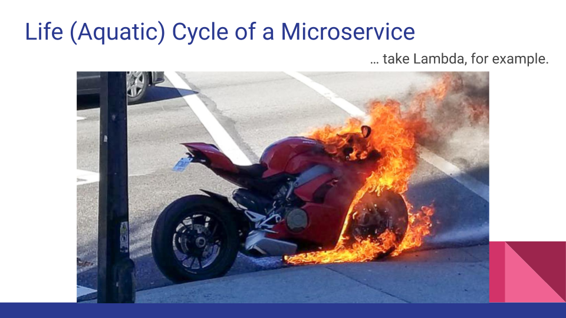
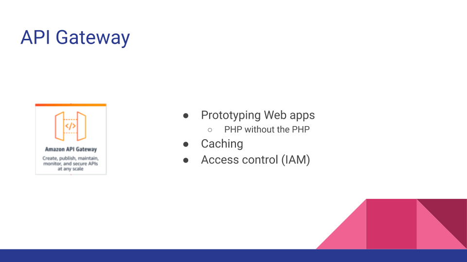
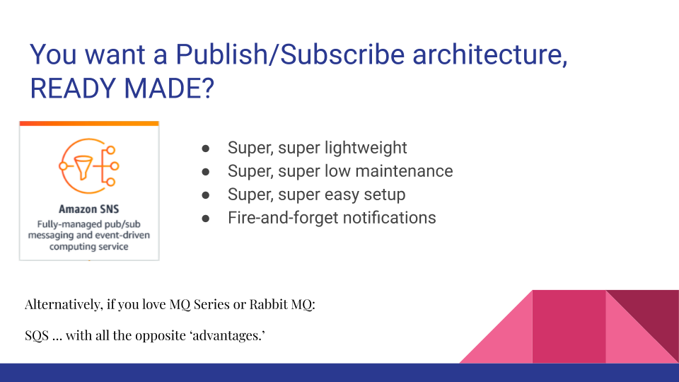
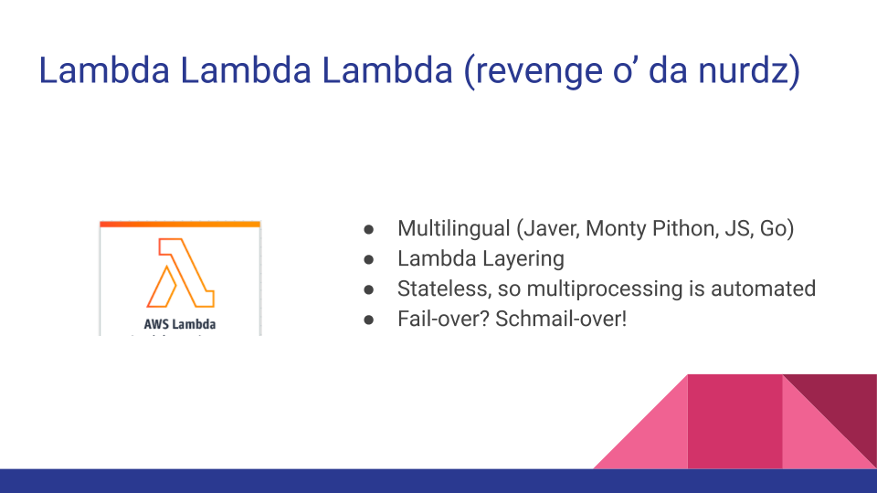
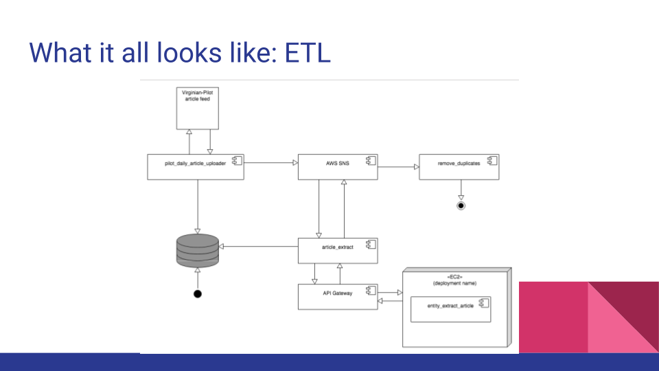
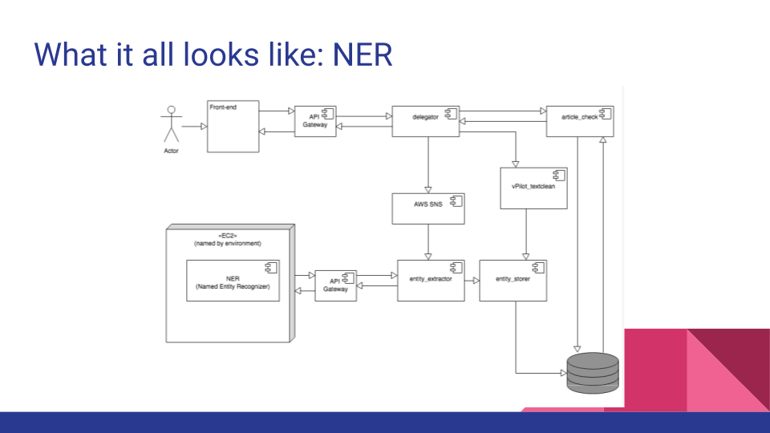

# Microservices

## Let's do this.

## mm, hm.

## Agenda, so WAKE IT UP! and pay close attention (quiz after)
* My Microservices Life (project and architectures)
* Microservices, and their life … cycle? MOTORCYCLES, MORE LIKE!
* Q&A after (with cookies!)
… oh, and PS, we’re talking about AWS microservices, because, really, what else is there? (1)

(1) Doug’s totally unbiased and impartial assessment.

## Microservices use, a start-up example

* Did you know – Forbes, BBC, Virginia Pilot, … journals and publications – how do they highlight ‘interesting terms’ in each article? Interns and Editors, by hand.
* OUR START-UP, TO THE RESCUE!
* Forbes: 3 million hits per month, Virginia Pilot, 20 hits per minute
* Our system: ETL of publication’s entire corpus updated every hour, NER, Clustering … all with microservices.

## Example Kinds of Microservices

So, whazza Microservice thingie?  … here’re some we used...

## FYRE!

## API Gateway

* Prototyping Web apps
* PHP without the PHP
* Caching
* Access control (IAM)

## SNS (Simple Notification Service)

### You want a Publish/Subscribe architecture, READY MADE?

* Super, super lightweight
* Super, super low maintenance
* Super, super easy setup
* Fire-and-forget notifications

Alternatively, if you love MQ Series or Rabbit MQ: 

SQS … with all the opposite ‘advantages.’

## Lambda, Lambda, Lambda

### Lambda Lambda Lambda (revenge o’ da nurdz)

* Multilingual (Javer, Monty Pithon, JS, Go)
* Lambda Layering
* Stateless, so multiprocessing is automated
* Fail-over? Schmail-over!

## What it looks like, e.g.: ETL

Question: Why not AWS Glue?

Answer: It wasn’t invented at the time, so ...

## What it looks like, e.g.: NER

(Named Entity Recognizer)

## POP QUIZ!

![Pop goes the quizzer)[imgs/11-Microservices-pop.png)

## LET'S RIDE!

