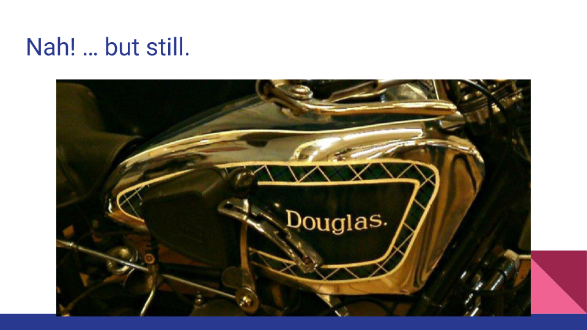
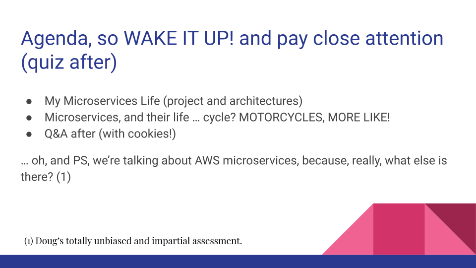
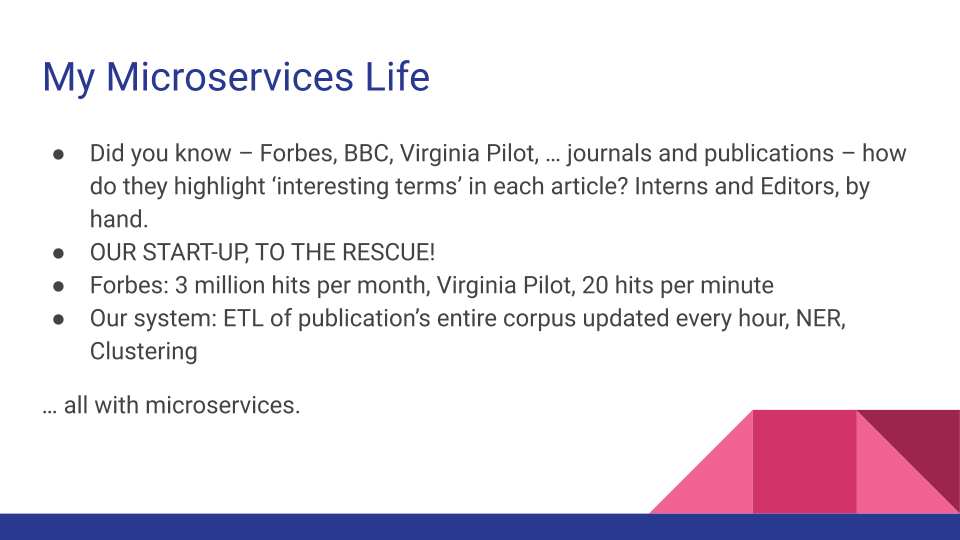
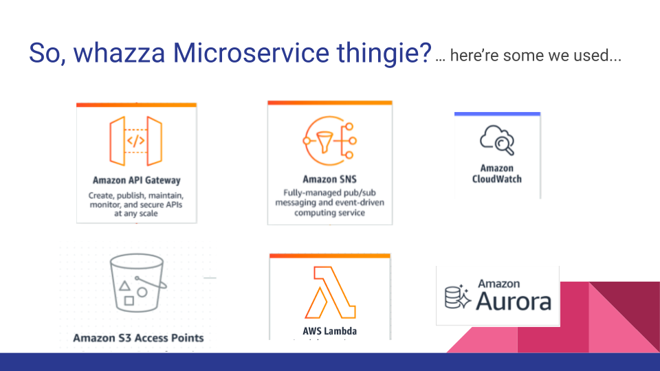

# Microservices

## Let's do this.

## mm, hm.

## Agenda, so WAKE IT UP! and pay close attention (quiz after)
* My Microservices Life (project and architectures)
* Microservices, and their life … cycle? MOTORCYCLES, MORE LIKE!
* Q&A after (with cookies!)
… oh, and PS, we’re talking about AWS microservices, because, really, what else is there? (1)

(1) Doug’s totally unbiased and impartial assessment.

## Microservices use, a start-up example

* Did you know – Forbes, BBC, Virginia Pilot, … journals and publications – how do they highlight ‘interesting terms’ in each article? Interns and Editors, by hand.
* OUR START-UP, TO THE RESCUE!
* Forbes: 3 million hits per month, Virginia Pilot, 20 hits per minute
* Our system: ETL of publication’s entire corpus updated every hour, NER, Clustering … all with microservices.

## Example Kinds of Microservices

